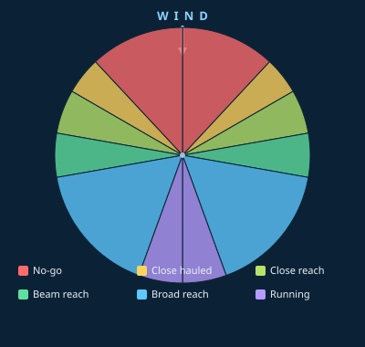

# Point of Sail

A small, dependency-free web app that shows a sailing yacht's **point of
sail** — its heading relative to the wind — and the sail trim that goes with
it. Turn the boat and the diagram, the named point of sail, the true wind
angle, and the tack all update live.



## Run it

No build step, no install. Just open the file:

```bash
# from this folder
open index.html          # macOS
xdg-open index.html      # Linux
# or serve it, if your browser is fussy about file:// URLs
python3 -m http.server 8000   # then visit http://localhost:8000
```

## Using it

- The **wind always blows down from the top** of the diagram.
- **Drag the slider**, **click/drag on the diagram**, or use the **← / →
  arrow keys** to turn the yacht.
- Click any row in the legend to jump to the middle of that point of sail.

The readout shows:

| Field | Meaning |
| --- | --- |
| **Heading** | The boat's heading, 0° = bow pointing straight into the wind, increasing clockwise. |
| **Wind angle** | The *true wind angle* (TWA): the heading folded into 0–180°. |
| **Tack** | Which side the wind crosses — **port** or **starboard**. |

## The points of sail

Measured by true wind angle (TWA), the angle between the boat's heading and
the wind:

| Point of sail | TWA | Notes |
| --- | --- | --- |
| **No-go zone** | 0–43° | Too close to the wind to sail; sails luff. Also called being *in irons*. |
| **Close hauled** | 43–60° | As close to the wind as the boat will sail, sheets in hard. |
| **Close reach** | 60–80° | Sheets eased a touch; fast and comfortable. |
| **Beam reach** | 80–100° | Wind on the beam, sails ~halfway out; often the fastest. |
| **Broad reach** | 100–160° | Wind over the quarter, sails well eased. |
| **Running** | 160–180° | Dead downwind, sails right out; mind the accidental gybe. |

> The exact boundaries between points of sail are conventions and vary a few
> degrees from one reference (or boat) to the next. The values above are a
> common teaching set; tweak `BANDS` in `app.js` to match yours.

## How the tack is decided

With the wind coming from the top:

- Heading **0–180°** (bow turned to the right) → the wind crosses the
  **port** side → **port tack**.
- Heading **180–360°** (bow turned to the left) → the wind crosses the
  **starboard** side → **starboard tack**.

At exactly head-to-wind (0°) or dead downwind (180°) there is no defined
tack, shown as `—`.

## Files

```
index.html    Markup + the inline SVG diagram
styles.css    Styling and the per-point-of-sail colour scheme
app.js        Sailing logic (pure helpers) + rendering + input handling
```

All the sailing rules live in the `BANDS` table and the small pure functions
(`trueWindAngle`, `tackOf`, `bandFor`) at the top of `app.js`, so they're easy
to read, test, and adjust.
